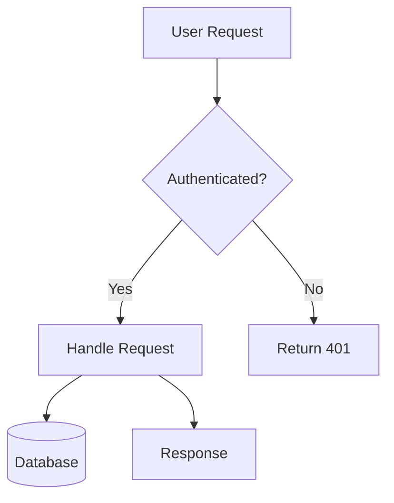
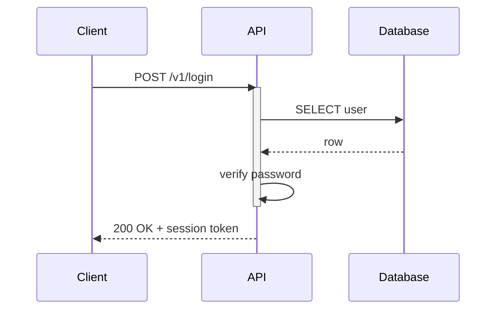
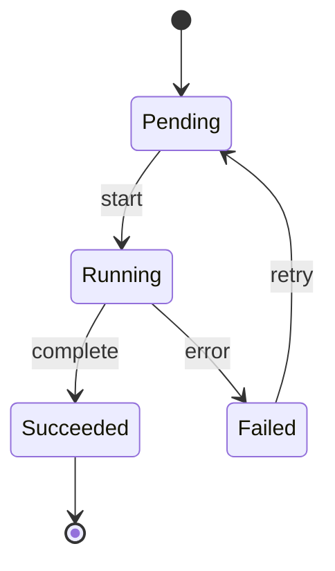
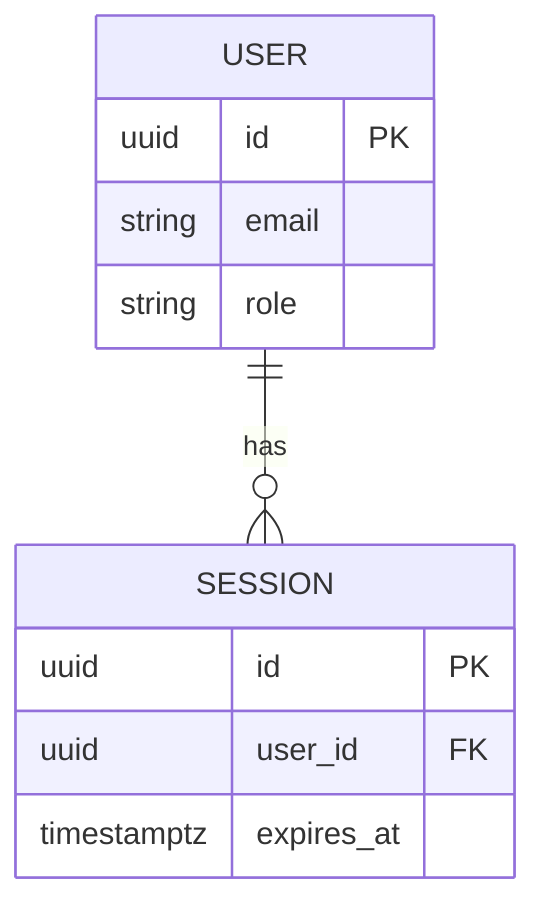

# Mermaid Diagram Policy

Mermaid blocks must parse on first try. The renderers used by GitHub, VS Code, and most static-site generators are strict, so follow these rules.

## Hard rules

1. **Always `graph TD` (top-down) for flowcharts.** Never `graph LR` — narrow viewports clip horizontal diagrams.
2. **Quote every node label.** Even simple words. The parser tolerates unquoted labels until they contain a special character, at which point it fails silently or partially.
3. **No special characters in subgraph names.** Alphanumeric and underscores only.
4. **No empty messages in sequence diagrams.** Use `;` as a placeholder when there is no payload.
5. **No shorthand activation.** Use explicit `activate` / `deactivate` blocks.
6. **No source citations inside diagrams.** Citations go in the prose around the diagram, never inside node labels.
7. **Keep it small.** ≤ 15 nodes per diagram, ≤ 4 words per label.

## Diagram types

| Type | Use for | Opening line |
|---|---|---|
| Flowchart | Process flow, data flow, decision trees | `graph TD` |
| Sequence | API calls, message exchange | `sequenceDiagram` |
| Class | Type relationships, inheritance | `classDiagram` |
| State | State machines, lifecycle | `stateDiagram-v2` |
| ER | Database schema, entity relationships | `erDiagram` |

## Examples

### Flowchart (correct)

````

````

### Sequence (correct)

````

````

### State (correct)

````

````

### ER (correct)

````

````

## Common errors and fixes

### Parse error from unquoted special characters

Wrong:

```
graph TD
    A[User (Admin)] --> B
```

Right:

```
graph TD
    A["User (Admin)"] --> B
```

### Edge label without pipes

Wrong:

```
graph TD
    A --> B: label
```

Right:

```
graph TD
    A -->|"label"| B
```

### Subgraph name with parentheses

Wrong:

```
graph TD
    subgraph Frontend(React)
        A["Component"]
    end
```

Right:

```
graph TD
    subgraph FrontendReact
        A["Component"]
    end
```

### Empty sequence message

Wrong:

```
sequenceDiagram
    A->>B:
```

Right:

```
sequenceDiagram
    A->>B: ;
```

### Shorthand activation

Wrong:

```
sequenceDiagram
    App->>+Service: Request
    Service-->>-App: Response
```

Right:

```
sequenceDiagram
    App->>Service: Request
    activate Service
    Service-->>App: Response
    deactivate Service
```

## Validation flow

After writing pages, attempt validation:

```bash
which mmdc || npm list -g @mermaid-js/mermaid-cli
```

If `mmdc` is on PATH, extract each ` ```mermaid` fenced block and pipe it through `mmdc --input - --output /tmp/check.svg --quiet`. Treat exit code 0 as valid.

If `mmdc` is unavailable, skip syntactic validation and instead do a static check:
- Opening line is one of the allowed types
- Every `[`, `{`, `(`, `((`, `{{` has a matching closer
- Every node label inside `[]`, `()`, `{}`, `((` is quoted
- Every subgraph name matches `[A-Za-z0-9_]+`

## Repair budget

For each invalid block, attempt at most 3 fixes. If still invalid after 3:
- Comment the block out with `<!--` / `-->`
- Add a marker line: `<!-- TODO: invalid mermaid block (see _meta/SUMMARY.md) -->`
- Record the failure in `_meta/SUMMARY.md`

Do not delete invalid blocks silently.

## When NOT to use Mermaid

If the relationship is better expressed as a table or a 4-line ASCII sketch, skip Mermaid. Diagrams that try to show > 15 nodes or > 3 levels of nesting are unreadable; replace them with a hierarchy of smaller diagrams or a table.
