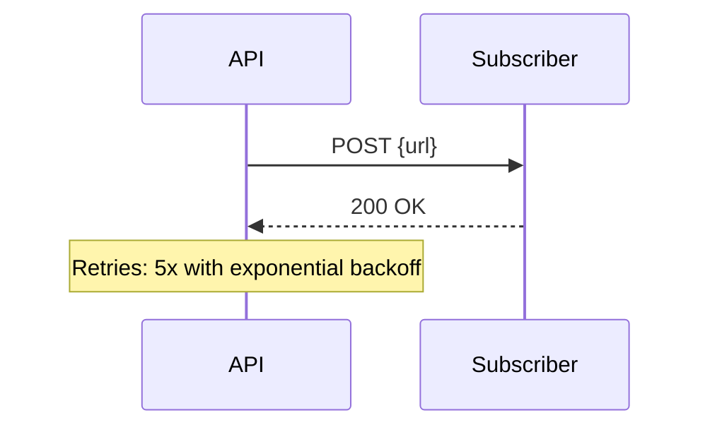

<!-- PAGE_ID: {page_id} -->
<details>
<summary>Relevant source files</summary>

- [path/to/file:N-M](path/to/file#LN-LM)

</details>

# {Project Name} -- API Reference

> **Base URL:** `{base_url}`
> **API Prefix:** `{prefix}`
> **Last Updated:** {YYYY-MM-DD}

> **Related Pages**: [Architecture](../core/ARCHITECTURE.md), [Authentication](../core/AUTHENTICATION.md)

---

<!-- BEGIN:AUTOGEN {page_id}_authentication -->
## Authentication Methods

| Method | Header / Mechanism | Description | Source |
|---|---|---|---|
| Session | `Authorization: Bearer <token>` | {who uses this} | [auth.ts:N-M](src/middleware/auth.ts#LN-LM) |
| API Key | `x-api-key` | {who uses this} | [api-key.ts:N-M](src/middleware/api-key.ts#LN-LM) |

Sources: [src/middleware/](src/middleware/)
<!-- END:AUTOGEN {page_id}_authentication -->

---

<!-- BEGIN:AUTOGEN {page_id}_response-patterns -->
## Common Response Patterns

### Success

```json
{
  "success": true,
  "data": { }
}
```

### Error

```json
{
  "error": "short_code",
  "message": "Human-readable description"
}
```

### Status Codes

| Code | Meaning |
|---|---|
| 200 | OK |
| 201 | Created |
| 400 | Bad Request / validation error |
| 401 | Unauthorized |
| 403 | Forbidden |
| 404 | Not Found |
| 409 | Conflict |
| 429 | Rate Limited |
| 500 | Internal Server Error |

Sources: [src/lib/response.ts:N-M](src/lib/response.ts#LN-LM)
<!-- END:AUTOGEN {page_id}_response-patterns -->

---

<!-- BEGIN:AUTOGEN {page_id}_rate-limiting -->
## Rate Limiting

| Endpoint Group | Limit | Window | Source |
|---|---|---|---|
| Auth | {n} requests | {window} | [auth.ts:N](src/middleware/auth.ts#LN) |
| Default | {n} requests | {window} | [rate-limit.ts:N](src/middleware/rate-limit.ts#LN) |

Sources: [src/middleware/rate-limit.ts](src/middleware/rate-limit.ts)
<!-- END:AUTOGEN {page_id}_rate-limiting -->

---

<!-- BEGIN:AUTOGEN {page_id}_resource-{resource} -->
## {Resource Group Name}

### Endpoints

| Method | Path | Auth | Description | Source |
|---|---|---|---|---|
| GET | `/v1/{resource}` | Session | List | [list.ts:N-M](src/routes/{resource}/list.ts#LN-LM) |
| POST | `/v1/{resource}` | Session | Create | [create.ts:N-M](src/routes/{resource}/create.ts#LN-LM) |
| GET | `/v1/{resource}/:id` | Session | Get one | [get.ts:N-M](src/routes/{resource}/get.ts#LN-LM) |
| PATCH | `/v1/{resource}/:id` | Session | Update | [update.ts:N-M](src/routes/{resource}/update.ts#LN-LM) |
| DELETE | `/v1/{resource}/:id` | Session | Delete | [delete.ts:N-M](src/routes/{resource}/delete.ts#LN-LM) |

### Request body schema (create / update)

```json
{
  "name": "string",
  "description": "string"
}
```

### Example

```http
POST /v1/{resource} HTTP/1.1
Authorization: Bearer ...
Content-Type: application/json

{ "name": "example" }
```

```json
HTTP/1.1 201 Created
Content-Type: application/json

{
  "success": true,
  "data": { "id": "...", "name": "example" }
}
```

Sources: [src/routes/{resource}/](src/routes/{resource}/)
<!-- END:AUTOGEN {page_id}_resource-{resource} -->

---

<!-- BEGIN:AUTOGEN {page_id}_webhooks -->
## Webhooks

| Event | Payload | Source |
|---|---|---|
| `{event_name}` | `{shape}` | [emitter.ts:N-M](src/webhooks/emitter.ts#LN-LM) |



Sources: [src/webhooks/](src/webhooks/)
<!-- END:AUTOGEN {page_id}_webhooks -->

---
