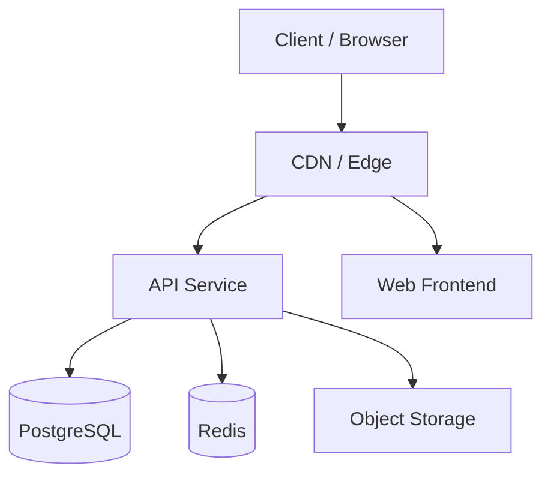
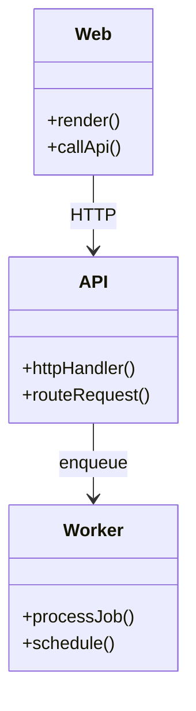
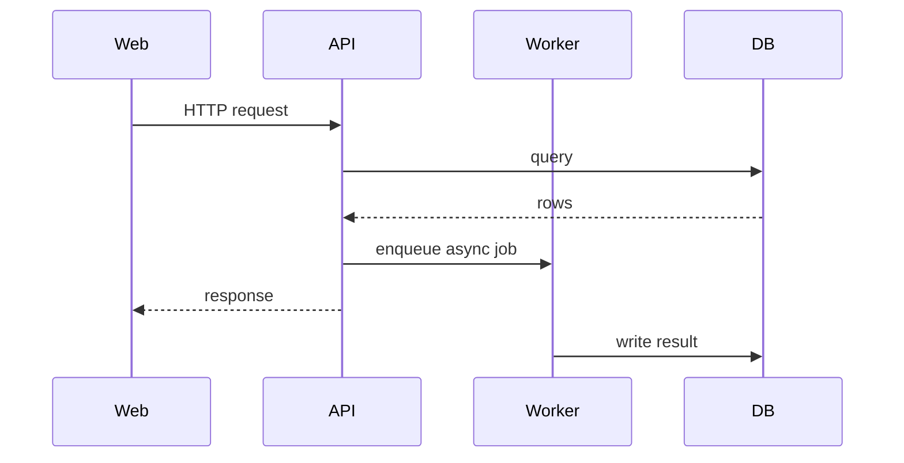

<!-- PAGE_ID: {page_id} -->

Relevant source files

- [path/to/file:N-M](path/to/file#LN-LM)

# {Project Name} -- Architecture

> **Related Pages**: [Overview](../OVERVIEW.md), [API Reference](../api/API_REFERENCE.md), [Runbook](../operations/RUNBOOK.md)

---

<!-- BEGIN:AUTOGEN {page_id}_system-overview -->
## System Overview

{1-2 sentence description of the overall topology and runtime.}

Sources: {entry-point citations}
<!-- END:AUTOGEN {page_id}_system-overview -->

---

<!-- BEGIN:AUTOGEN {page_id}_environments -->
## Environments

| Environment | Purpose | URLs | Notes |
|---|---|---|---|
| Production | Live customer-facing | {urls} | {scaling notes} |
| Staging | Pre-prod validation | {urls} | {differences from prod} |
| Local | Developer machine | localhost | docker-compose |

Sources: [docker-compose.yml:1-N](docker-compose.yml#L1-LN), [infra/](infra/)
<!-- END:AUTOGEN {page_id}_environments -->

---

<!-- BEGIN:AUTOGEN {page_id}_components -->
## Components

| Component | Entry | Responsibility | Source |
|---|---|---|---|
| API | `src/api/server.ts` | HTTP request handling | [server.ts:1-N](src/api/server.ts#L1-LN) |
| Worker | `src/worker/index.ts` | Background jobs | [index.ts:1-N](src/worker/index.ts#L1-LN) |
| Web | `apps/web/...` | Next.js dashboard | [package.json:N-M](apps/web/package.json#LN-LM) |

Sources: {component citations}
<!-- END:AUTOGEN {page_id}_components -->

---

<!-- BEGIN:AUTOGEN {page_id}_communication -->
## Service Communication

{Describe how services talk: REST, gRPC, message queue, pub/sub, etc.}

Sources: {citations}
<!-- END:AUTOGEN {page_id}_communication -->

---

<!-- BEGIN:AUTOGEN {page_id}_interfaces -->
## Interfaces and Contracts

- {External APIs the system exposes (with link to API_REFERENCE.md)}
- {External APIs the system consumes (with version pins)}
- {Internal contracts between services (message formats, schemas)}

Sources: [openapi.yaml](openapi.yaml), [src/contracts/](src/contracts/)
<!-- END:AUTOGEN {page_id}_interfaces -->

---

<!-- BEGIN:AUTOGEN {page_id}_runtime -->
## Runtime and Deployment

{How services are packaged and deployed. Containers? Lambdas? VM image?}

| Service | Container Image | CPU | Memory | Replicas |
|---|---|---|---|---|
| api | {image} | {n} | {n}MB | {n} |
| worker | {image} | {n} | {n}MB | {n} |

Sources: [Dockerfile](Dockerfile), [infra/](infra/)
<!-- END:AUTOGEN {page_id}_runtime -->

---

<!-- BEGIN:AUTOGEN {page_id}_scaling -->
## Scaling and Performance

- {Throughput characteristics of each service}
- {Bottlenecks and back-pressure points}
- {Caching layers}

Sources: {citations or "_TBD_"}
<!-- END:AUTOGEN {page_id}_scaling -->

---

<!-- BEGIN:AUTOGEN {page_id}_failure-modes -->
## Failure Modes and Reliability

| Failure | Detection | Mitigation |
|---|---|---|
| {failure} | {how detected} | {how handled} |

Sources: {error-handler citations or "_TBD_"}
<!-- END:AUTOGEN {page_id}_failure-modes -->

---
