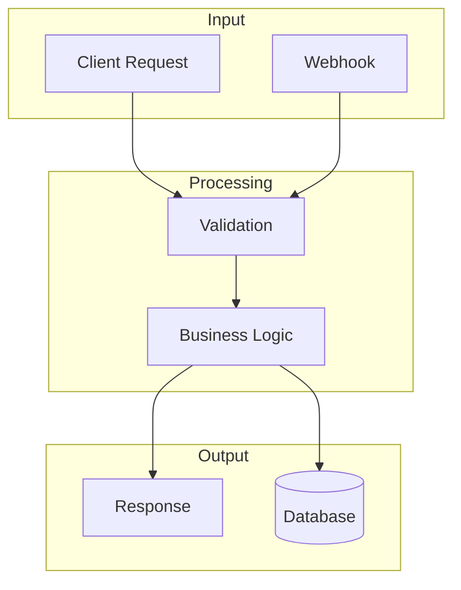

<!-- PAGE_ID: {page_id} -->
<details>
<summary>Relevant source files</summary>

- [path/to/file:N-M](path/to/file#LN-LM)

</details>

# Data Flow

> **Related Pages**: [Architecture](ARCHITECTURE.md), [Database Schema](DATABASE_SCHEMA.md)

---

<!-- BEGIN:AUTOGEN {page_id}_primary-flows -->
## Primary Flows

| Flow | Trigger | Outcome | Source |
|---|---|---|---|
| {flow} | {what triggers it} | {what results} | [path:N](path#LN) |

Sources: {citations}
<!-- END:AUTOGEN {page_id}_primary-flows -->

---

<!-- BEGIN:AUTOGEN {page_id}_diagram -->
## Diagram



Sources: {citations}
<!-- END:AUTOGEN {page_id}_diagram -->

---

<!-- BEGIN:AUTOGEN {page_id}_steps -->
## Step-by-Step

1. **{Step name}** -- {what happens} ([file:N-M](path#LN-LM))
2. **{Step name}** -- {what happens} ([file:N-M](path#LN-LM))
3. **{Step name}** -- {what happens} ([file:N-M](path#LN-LM))

Sources: {citations}
<!-- END:AUTOGEN {page_id}_steps -->

---

<!-- BEGIN:AUTOGEN {page_id}_io-table -->
## Inputs and Outputs

| Type | Name | Location | Description |
|---|---|---|---|
| Input | {name} | {file/CLI/env} | {purpose} |
| Output | {name} | {file/dir/API} | {purpose} |

Sources: {citations}
<!-- END:AUTOGEN {page_id}_io-table -->

---

<!-- BEGIN:AUTOGEN {page_id}_data-structures -->
## Data Structures

```typescript
type {Name} = {
  field: type;
  // ...
};
```

Sources: [types.ts:N-M](path/types.ts#LN-LM)
<!-- END:AUTOGEN {page_id}_data-structures -->

---

<!-- BEGIN:AUTOGEN {page_id}_state -->
## State and Storage

- {Datastore name} -- {what data lives here, retention}
- {Cache name} -- {what is cached, TTL}

Sources: {citations}
<!-- END:AUTOGEN {page_id}_state -->

---

<!-- BEGIN:AUTOGEN {page_id}_failure-modes -->
## Failure Modes

| Stage | Failure | Behavior |
|---|---|---|
| {stage} | {failure} | {handling} |

Sources: {error-handler citations}
<!-- END:AUTOGEN {page_id}_failure-modes -->

---
