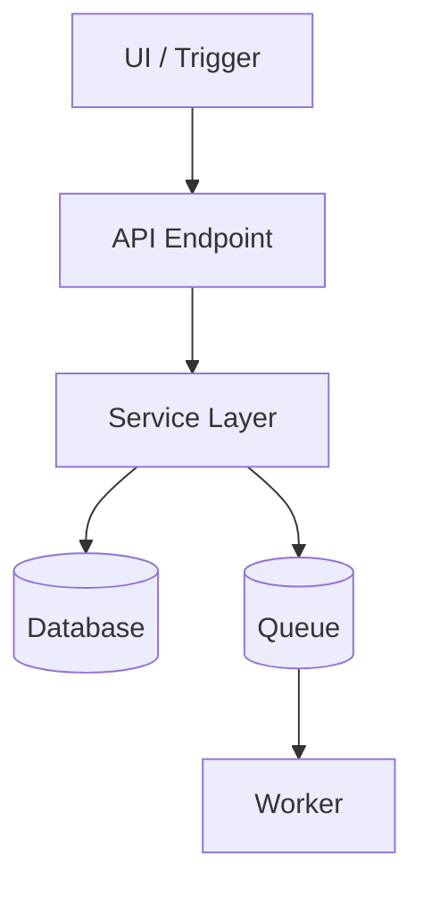
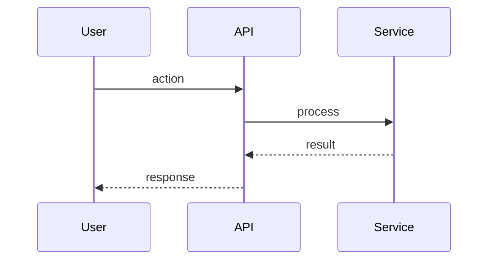

<!-- PAGE_ID: {page_id} -->

Relevant source files

- [path/to/file:N-M](path/to/file#LN-LM)

# {Feature Name}

> **Related Pages**: [Architecture](../core/ARCHITECTURE.md), [API Reference](../api/API_REFERENCE.md)

---

<!-- BEGIN:AUTOGEN {page_id}_overview -->
## Overview

{1-2 sentence description of what this feature does and who uses it.}

{Paragraph explaining the user-facing behavior and the major moving parts.}

Sources: {entry-point citations}
<!-- END:AUTOGEN {page_id}_overview -->

---

<!-- BEGIN:AUTOGEN {page_id}_architecture -->
## Architecture

| Component | File | Responsibility |
|---|---|---|
| UI trigger | [path:N](path#LN) | {what it does} |
| API endpoint | [path:N](path#LN) | {what it does} |
| Service layer | [path:N](path#LN) | {what it does} |
| Worker | [path:N](path#LN) | {what it does} |

Sources: {citations}
<!-- END:AUTOGEN {page_id}_architecture -->

---

<!-- BEGIN:AUTOGEN {page_id}_data-model -->
## Data Model

| Table / Type | Purpose | Source |
|---|---|---|
| `{table}` | {purpose} | [migration.sql:N-M](migrations/X.sql#LN-LM) |

Sources: [migrations/](migrations/), [src/models/](src/models/)
<!-- END:AUTOGEN {page_id}_data-model -->

---

<!-- BEGIN:AUTOGEN {page_id}_api-surface -->
## API Surface

| Method | Path | Description | Source |
|---|---|---|---|
| {METHOD} | `{path}` | {description} | [route.ts:N-M](src/routes/route.ts#LN-LM) |

Sources: {route citations}
<!-- END:AUTOGEN {page_id}_api-surface -->

---

<!-- BEGIN:AUTOGEN {page_id}_flows -->
## Key Flows

### {Flow name}

1. {Step description with citation}
2. {Step description with citation}
3. {Step description with citation}

Sources: {citations}
<!-- END:AUTOGEN {page_id}_flows -->

---

<!-- BEGIN:AUTOGEN {page_id}_configuration -->
## Configuration

| Variable | Required | Default | Description | Source |
|---|---|---|---|---|
| `{ENV_VAR}` | Yes/No | `{value}` | {description} | [config.ts:N](src/config.ts#LN) |

Sources: [.env.example](.env.example), [src/config.ts](src/config.ts)
<!-- END:AUTOGEN {page_id}_configuration -->

---

<!-- BEGIN:AUTOGEN {page_id}_failure-modes -->
## Failure Modes and Edge Cases

| Failure | Detection | Recovery | Source |
|---|---|---|---|
| {failure} | {detection} | {recovery} | [error.ts:N](src/error.ts#LN) |

Sources: {error-handler citations}
<!-- END:AUTOGEN {page_id}_failure-modes -->

---

<!-- BEGIN:AUTOGEN {page_id}_operational -->
## Operational Notes

- {Monitoring hooks, metrics emitted}
- {On-call procedures specific to this feature}
- {Known performance characteristics}

Sources: {citations or "_TBD_"}
<!-- END:AUTOGEN {page_id}_operational -->

---
