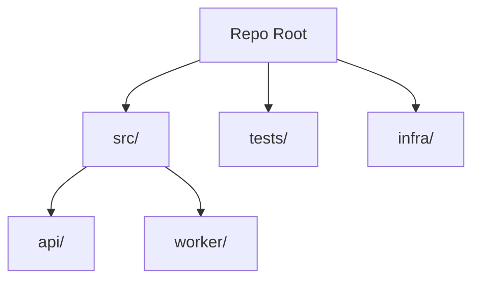

<!-- PAGE_ID: {page_id} -->

Relevant source files

- [path/to/file:N-M](path/to/file#LN-LM)

# {Project Name} -- Overview

> **Related Pages**: [Architecture](core/ARCHITECTURE.md), [Getting Started](GETTING_STARTED.md)

---

<!-- BEGIN:AUTOGEN {page_id}_introduction -->
## Introduction

{1-2 sentence summary of what this project is and who uses it.}

{Paragraph with the project's primary value proposition, drawn from README and package.json.}

Sources: [README.md:1-N](README.md#L1-LN), [package.json:1-N](package.json#L1-LN)
<!-- END:AUTOGEN {page_id}_introduction -->

---

<!-- BEGIN:AUTOGEN {page_id}_purpose -->
## Purpose and Users

- {Primary purpose}
- {Primary users / consumers}
- {Key business context}

Sources: [README.md:N-M](README.md#LN-LM)
<!-- END:AUTOGEN {page_id}_purpose -->

---

<!-- BEGIN:AUTOGEN {page_id}_stack -->
## Technology Stack

| Layer | Technology | Version | Source |
|---|---|---|---|
| Language | {lang} | {version} | [package.json:N](package.json#LN) |
| Framework | {framework} | {version} | [package.json:N](package.json#LN) |
| Datastore | {db} | {version} | [docker-compose.yml:N](docker-compose.yml#LN) |
| Cache | {cache} | {version} | ... |
| Build | {tool} | {version} | ... |

Sources: [package.json:1-N](package.json#L1-LN)
<!-- END:AUTOGEN {page_id}_stack -->

---

<!-- BEGIN:AUTOGEN {page_id}_layout -->
## Repository Layout

| Directory | Purpose |
|---|---|
| `src/` | {what lives here} |
| `tests/` | {what lives here} |
| `infra/` | {what lives here} |
| `docs/` | {what lives here} |

Sources: top-level directory listing at commit `{commit[:7]}`
<!-- END:AUTOGEN {page_id}_layout -->

---

<!-- BEGIN:AUTOGEN {page_id}_entry-points -->
## Entry Points

- **API server:** [src/api/server.ts](src/api/server.ts) — `npm run start:api`
- **Worker:** [src/worker/index.ts](src/worker/index.ts) — `npm run start:worker`
- **CLI:** [src/cli/main.ts](src/cli/main.ts) — `npm run cli -- <command>`

Sources: [package.json:N-M](package.json#LN-LM)
<!-- END:AUTOGEN {page_id}_entry-points -->

---

<!-- BEGIN:AUTOGEN {page_id}_where-to-start -->
## Where to Start

| Goal | Start Here |
|---|---|
| Run locally | [GETTING_STARTED.md](GETTING_STARTED.md) |
| Understand the system | [ARCHITECTURE.md](core/ARCHITECTURE.md) |
| Find an endpoint | [API_REFERENCE.md](api/API_REFERENCE.md) |
| Operate / deploy | [RUNBOOK.md](operations/RUNBOOK.md) |

Sources: navigation curated by doc-sync
<!-- END:AUTOGEN {page_id}_where-to-start -->

---

<!-- BEGIN:AUTOGEN {page_id}_pitfalls -->
## Common Pitfalls

- {Known gotcha #1, with source if applicable}
- {Known gotcha #2}

Sources: {citations or "_TBD_"}
<!-- END:AUTOGEN {page_id}_pitfalls -->

---
